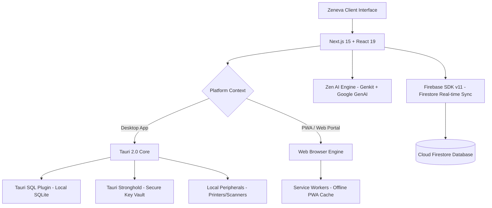

# 🌌 ZENEVA | Industrial Retail Operating System (POS & ERP)


Welcome to **Zeneva**, a borderless, industrial-grade retail operating system built for high-performance retail operations, multi-store POS, predictive inventory analytics, and local-first reliability. Zeneva is designed to unify your physical brick-and-mortar storefronts and digital inventory into a single, cohesive, sub-10ms operational engine.

---

## 🚀 Key Platforms & Deployment Targets

1. **Desktop Workstation (Windows/macOS)**
   * Built with **Tauri 2.0** and **Next.js 15** for native, ultra-lightweight performance.
   * Directly interfaces with physical hardware (thermal receipt printers, barcode scanners, cash drawers).
   * Sub-10ms UI responsiveness, managing 10k+ SKUs completely offline.

2. **Tactical Mobile Manager (Android)**
   * Multi-platform Progressive Web App (PWA) compiled natively or deployed as a PWA using `@ducanh2912/next-pwa`.
   * Enables on-the-floor inventory auditing, direct sales scanning via camera, and real-time push alerts.

3. **Cloud Web Portal & Admin Console**
   * Access global analytics, multi-tenant reports, and administrative management panels from any modern browser.

---

## 🛠️ Technical Stack & Architecture

> **Full architecture write-up: [`docs/technology.md`](docs/technology.md)** —
> what every piece is for, why it was chosen, and the operational details that
> have cost real debugging time. The summary below is the shape of it.

Zeneva is built on a modern, robust, resilient stack designed for secure multi-tenant execution and lightning-fast speed:



### 1. Front-end Framework & Desktop Shell
* **Next.js 15.5.9** (using App Router, Turbopack, and **React 19**) for state-of-the-art server/client components and fast rendering.
* **Tauri 2.0** (Rust-backed desktop framework) for native compilation. It provides highly secure and lightweight native OS windows, running with a fraction of the memory footprint of Electron.
* **Framer Motion** for premium, fluid transitions and subtle micro-animations that improve tactile UX.

### 2. Local-First Engine & Storage
* **Tauri SQL Plugin (`@tauri-apps/plugin-sql`)**: Local **SQLite** database mirror. Zeneva is fully functional offline; sales and inventory updates are performed instantly against the local cache and queued for sync to Firestore.
* **Firebase SDK v11.9.1**: Connects client states to **Cloud Firestore** for multi-tenant, cloud-synced storage when internet connectivity is active. Firestore is the source of truth; the local SQLite database is a mirror of it, not a second store.
* **Firebase Admin SDK v13.6.1**: Provides multi-tenant data validation, user authorization, and secure back-end operations.
* **Upstash Redis (Admin Caching Engine)**: The global platform admin dashboard is powered by a custom Next.js API Route utilizing `@upstash/redis`. Instead of the browser pulling 10,000+ receipts and users on every load, a dedicated Serverless Function aggregates all global GMV, MRR, ARR, and sales velocity data via the Firebase Admin SDK. This massive data object is then serialized and cached in Upstash Redis.
  * **Result**: Admin payload size drops from megabytes to kilobytes.
  * **Speed**: Admin Dashboard and Achievements screens load globally in under 200ms without triggering massive Firestore read quotas.
  * **Invalidation**: The cache operates on a TTL, and admins can trigger a forced cache invalidation using the platform interface to instantly sync real-time data.

### 3. Zen AI Engine (Predictive Analytics)
* **Genkit v1.20.0** combined with **Google GenAI** (`@genkit-ai/google-genai`) for the deterministic analysis side, and the **Vercel AI SDK** (`ai` v7 + `@ai-sdk/react` v4) for the streaming chat at `/ai-insights`.
* **41 tools** in `src/app/api/chat/tools.ts` give the chat typed access to the business's own data.
* **Core Capabilities**: Analyzes product sales velocity, highlights "trapped cash" in slow-moving inventory, identifies potential duplicates or pricing discrepancies, and provides deterministic replenishment suggestions.
* **Two hard boundaries**: Zen AI **never writes on the server** (a `propose*` tool returns a card; the write happens client-side after the owner approves) and **never stores prompt text** (usage analytics record an intent label plus an allow-listed keyword, never the prompt). See [`docs/zen-ai.md`](docs/zen-ai.md).

### 4. Peripherals, Printing & Imaging
* **`html5-qrcode`**: Leverages device camera feeds for high-fidelity, real-time barcode scanning.
* **`react-barcode`** & **`qrcode.react`**: Programmatic generation of physical barcodes and dynamic payment/receipt QR codes.
* **`html2canvas`** & **`jspdf`**: Client-side rendering of beautiful receipts, which can be instantly compiled into PDFs and sent to thermal or system printers.

### 5. Security & Cryptography
* **`@tauri-apps/plugin-stronghold`**: Rust-implemented secure, encrypted key-value vault to protect enterprise API credentials, offline session keys, and database secrets.
* **`crypto-js`** & **`otpauth`**: Cryptographically secure OTP (One-Time Password) generation, multi-factor authentication, and locally encrypted transaction states.

### 6. Communications & Notifications
* **Resend & Nodemailer**: Enterprise email dispatching for digital receipts, audit logs, and critical operational reports.
* **Tauri Notification Plugin (`@tauri-apps/plugin-notification`)**: Native system notification integrations for desktop platforms.

### 7. Marketing Recorder
* The admin area's **Marketing Studio** drives a headless-Chrome recorder (`scripts/record/`) that logs into the real app and records real flows — POS, inventory, Zen AI — with a custom cursor, click effects, camera punch-ins, a phone chassis for mobile takes, and synthesized or supplied audio.
* Built on **raw Chrome DevTools Protocol** over Node's global `WebSocket` (no Playwright), with ffmpeg as the only external dependency. Videos are real footage of the app, not animations.
* See [`scripts/record/README.md`](scripts/record/README.md).

---

## 🛡️ Core Capabilities & Modules

* **Multi-Tenant Inventory Management**: Complete product catalogs bound securely by `businessId`. Supports product variants (grouped by same product name with separate SKU/price matrices) and seamless CSV bulk importing/exporting with `papaparse`.
* **Guided POS Workflow**: Intuitive cash-register workflow supporting fluid cart item increments, coupon or discount processing, customer profile associations, and instant receipt generation.
* **Real-time Inventory Troubleshooter**: Algorithmic scanner checking for missing pricing, lack of categorized products, or redundant stock.
* **Role-Based Access Control (RBAC)**: Fine-grained user access management restricting screens and workflows based on roles (`admin`, `manager`, `vendor_operator`).

---

## ⚙️ Developer Setup & Installation

Follow these steps to set up and run Zeneva in your local development environment:

### Prerequisites
* **Node.js**: v18.x or higher
* **Rust & Cargo** (Required for Tauri desktop builds): See [Tauri Prerequisites Guide](https://v2.tauri.app/start/prerequisites/)

### 1. Clone the Codebase
```bash
git clone https://github.com/I-m-a-m-4/zeneva.git
cd zeneva
```

### 2. Configure Environment Variables
Create a `.env.local` file in the root directory and specify your Firebase, Genkit, and API secrets:
```env
# Firebase Configuration
NEXT_PUBLIC_FIREBASE_API_KEY=your_api_key
NEXT_PUBLIC_FIREBASE_AUTH_DOMAIN=your_auth_domain
NEXT_PUBLIC_FIREBASE_PROJECT_ID=your_project_id
NEXT_PUBLIC_FIREBASE_STORAGE_BUCKET=your_storage_bucket
NEXT_PUBLIC_FIREBASE_MESSAGING_SENDER_ID=your_messaging_sender_id
NEXT_PUBLIC_FIREBASE_APP_ID=your_app_id

# Google Gemini AI Secret
GEMINI_API_KEY=your_gemini_api_key

# Email Dispatcher Configurations (Resend / Nodemailer)
RESEND_API_KEY=your_resend_api_key
```

### 3. Install Dependencies
Ensure package overrides are respected and apply necessary package patches:
```bash
npm install
```

### 4. Run Development Servers
* **Run Web Application (Next.js)**:
  ```bash
  npm run dev
  ```
  The NextJS portal will be accessible locally at `http://localhost:9007`.

* **Run Desktop Workstation (Tauri Dev Mode)**:
  ```bash
  npm run tauri dev
  ```
  This will launch the native Tauri desktop shell with hot-reloading active.

### 5. Build for Production
* **Compile Web/PWA distribution**:
  ```bash
  npm run build
  ```
* **Compile Native Desktop Executables (Windows/macOS/Linux)**:
  ```bash
  npm run tauri build
  ```

---

## 🔄 Git Branching & CI/CD Workflow
* **`main`**: Production-ready code. Releases are triggered automatically via GitHub Actions `.github/workflows/release.yml`.
* **Development Flow**: Create descriptive feature branches (e.g., `feature/pos-offline-sync`), perform rigorous typechecks (`npm run typecheck`), and verify code compliance before opening Pull Requests.

---

© 2026 Zeneva POS & Retail OS. All Rights Reserved. Engineered for the future of borderless retail operations.
